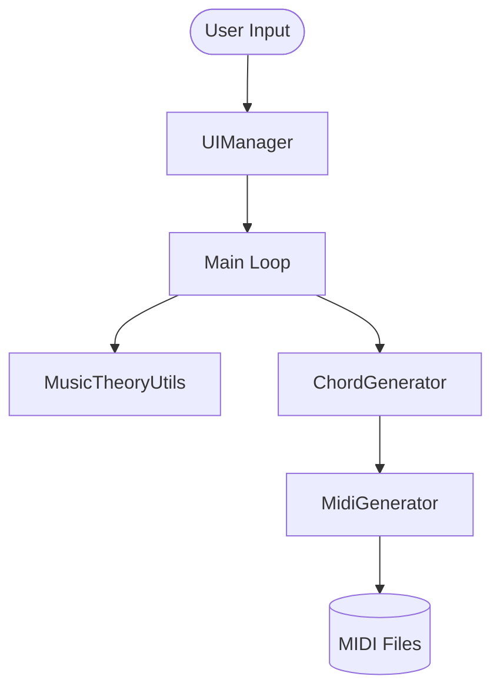

# System Architecture

This document describes the internal structure and design principles of Chorderizer.

## Design Philosophy

Chorderizer follows a **Modular Separation of Concerns** approach to keep music theory logic distinct from generation and presentation.

## Core Modules

### 1. Theory Engine (`theory_utils.py`)

The "brain" of the project.

- **`MusicTheory`**: A static repository of constants (intervals, scales, chord structures, MIDI programs).
- **`MusicTheoryUtils`**: Pure functions for note parsing, transposition logic, and key heuristics.
- *Responsibility*: Ensuring musical correctness.

### 2. Logic Generators (`generators.py`)

Handles the transition from abstract theory to tangible data.

- **`ChordGenerator`**: Calculates MIDI note sequences and voicings for scales based on extensions and inversions. Implements a caching mechanism (`_chord_cache`) to avoid redundant calculations.
- **`MidiGenerator`**: Orchestrates `mido` track creation, arpeggiation, and strumming effects.
- **`TablatureGenerator`**: Maps MIDI notes to a simplified 6-string guitar neck model.

### 3. CLI Orchestration (`ui.py` & `chorderizer.py`)

- **`UIManager`**: Handles all filtered input and colored output using `colorama`.
- **`chorderizer.py` (Main)**: Acts as the Controller, handling the high-level loop and file system interactions.

## Data Flow

## voincing Logic

The `ChordGenerator` uses a heuristic to keeps voicings around the C4 (MIDI 60) range. It uses a "last_added_midi_note" strategy to ensure notes are always in ascending order, creating basic but playable "spread" voicings.
